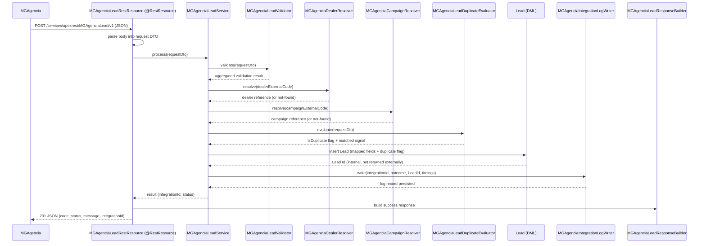
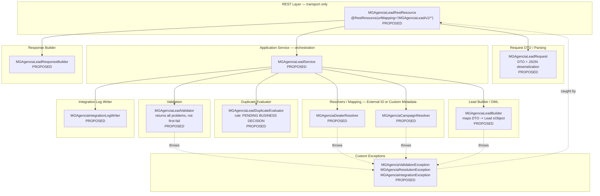

# ARCHITECTURE

MGAgencia → Salesforce Lead Integration — v1 architecture map.

Status: DRAFT — Phase 1 (Salesforce discovery) in progress. This document defines
boundaries and sequencing; it does not define field mappings, catalog values,
duplicate criteria, or authentication mechanism. Those remain pending as noted
throughout and consolidated in §11.

---

## 1. Context and scope

- **Scope**: v1 only. Direct Apex REST exposed from Salesforce; no middleware,
  no external API Gateway. Any change to this boundary requires an explicit,
  separately approved decision (see `docs/DECISIONS.md`, 2026-08-26).
- **Direction**: MGAgencia (advertising Lead source) → Salesforce REST endpoint →
  Lead creation → response to MGAgencia. Salesforce is the system of record for
  the Lead; MGAgencia is the API consumer only.
- **Environments**: `condor-qas` sandbox is the default and only target for
  development, discovery, and testing. `mi-org` (production) requires explicit
  confirmation before any deployment or write.
- **Out of scope for v1**: Lead status query endpoint (GET), batch/bulk
  ingestion endpoint, middleware/gateway component. May become future phases
  if business requirements confirm them (CLAUDE.md, "Pending external
  decisions").
- **Non-negotiable constraints carried from CLAUDE.md**: no Salesforce Record
  IDs exposed externally, no invented business rules/mappings/catalog values,
  every unresolved decision explicitly flagged, transport separated from
  business logic, every request traceable, predictable documented errors,
  governor limits respected, every implementation covered by automated tests.

---

## 2. End-to-end flow

Primary path (validation passes, dealer/campaign resolve, Lead is created —
duplicate or not). Branch outcomes are described in prose below the diagram
rather than fully expanded in Mermaid, to keep the happy path legible.

**Branch outcomes not drawn above** (each still writes an integration log
entry before responding, per CLAUDE.md §Logging):

- Malformed JSON → REST layer short-circuits before the service → `400`.
- Validation failure (missing/invalid fields) → service returns all
  accumulated problems → `422`.
- Dealer/campaign code does not resolve → business validation failure, not a
  system error → `422`.
- Unexpected processing error (DML exception, unclassified resolver
  exception) → `500`, no raw exception message returned.
- Authentication/authorization failure → rejected before the service runs →
  `401` / `403`.
- Duplicate detected → **not** an error branch; the Lead is still created and
  flagged, flowing through the same happy path shown above.

---

## 3. Component map (layered boundaries)

All class names below are **PROPOSED** — naming convention only, not yet
implemented, subject to review by `salesforce-developer` at Phase 5. Prefix
`MGAgencia` used consistently to namespace the integration.

**Boundary rules**:

- `MGAgenciaLeadRestResource` never contains business logic: parse → delegate →
  serialize response, per CLAUDE.md §REST Layer.
- `MGAgenciaLeadService` is the only orchestrator; sole caller of the validator,
  resolvers, duplicate evaluator, builder, and log writer.
- Resolvers never hardcode mapping values in Apex; they read from External ID
  fields or Custom Metadata (final strategy: see §4 and §11).
- `MGAgenciaLeadDuplicateEvaluator` computes a flag/signal only; it never blocks
  Lead creation. All SOQL/DML in resolvers and the builder must be bulk-safe
  (no SOQL/DML inside loops), even though v1 is single-record — see §8.

---

## 4. Metadata inventory to be created (proposed)

All items below are **PROPOSED** pending Phase 1 discovery confirmation and,
where marked, an explicit business decision. None are to be deployed before
Phase 4.

| Metadata item | Purpose | Notes |
| --- | --- | --- |
| Integration log custom object (e.g. `MGAgencia_Integration_Log__c`) | Traceability record per inbound request (§7) | Field sketch below — no PII beyond what CLAUDE.md permits |
| Duplicate-flag field on `Lead` (e.g. `MGAgencia_Is_Duplicate__c`, `MGAgencia_Duplicate_Signal__c`) | Marks a Lead created despite a detected duplicate match | Detection rule is **PENDING BUSINESS DECISION** |
| External-code field(s) for dealer resolution (e.g. External ID on Dealer object, or Custom Metadata row keyed by dealer code) | Resolve MGAgencia dealer code → internal Dealer reference without exposing Record IDs | Exact object/field is **PENDING DISCOVERY** (Phase 1) |
| External-code field(s) for campaign resolution (e.g. External ID on `Campaign`, or Custom Metadata) | Resolve MGAgencia campaign code → internal Campaign reference | Exact object/field is **PENDING DISCOVERY**; campaign identification approach itself is **PENDING BUSINESS DECISION** (CLAUDE.md) |
| Custom Metadata Type for configuration (e.g. `MGAgencia_Integration_Setting__mdt`) | Externalize environment-dependent values (endpoint toggles, feature flags) — avoid hardcoded values per CLAUDE.md §5 | Contents to be defined once Phase 3/4 requirements are known |
| Permission Set for the integration user (e.g. `MGAgencia_Integration_User`) | Least-privilege access: API Enabled, Apex class access, Lead create/read, field-level security, Dealer/Campaign lookup, integration log write | No System Administrator profile; see §9 |
| Connected App / authentication mechanism | Authenticates MGAgencia's inbound calls | **PENDING BUSINESS DECISION** — see §5 note and §11; not designed here |

**Integration log field sketch** (no PII, no secrets, indicative only,
finalized at Phase 4): `Integration_Id__c` (external identifier, §5),
`Received_At__c` / `Processing_Duration_Ms__c`, `Origin__c` (caller/source,
not raw IP/PII unless required), `External_Lead_Id__c` (if the MGAgencia
identifier decision is confirmed — §11), `Result__c` (created /
created-duplicate / validation-failed / error), `Lead__c` (lookup to the
created Lead, internal use only, never returned), `Validation_Problems__c`
(structured, no stack traces), `Error_Code__c` (internal classification, no
raw exception message), `Response_Code_Sent__c` (HTTP status returned).

---

## 5. Identifier strategy

Salesforce Record IDs are never returned to MGAgencia (CLAUDE.md §Core
principles, §API behavior). An **integration identifier** is returned instead.
Two implementation options, both viable, trade-off noted — final choice
deferred to Phase 3/4 once discovery confirms log-object and Lead
External-ID field availability:

| Option | Description | Trade-offs |
| --- | --- | --- |
| **A — UUID on log record** | `MGAgenciaLeadService` generates a UUID (or Salesforce `Crypto.getAes...`/`generateUUIDString`) at request time, stores it as `Integration_Id__c` on the integration log record, returns it to MGAgencia. | Decouples identifier from Lead lifecycle; survives even if Lead creation later needs correction. Requires a lookup from `Integration_Id__c` → log → Lead if a future status-query endpoint is approved. No Salesforce-native uniqueness enforcement without an explicit unique field/validation rule. |
| **B — External field on Lead** | Same UUID (or MGAgencia-supplied `external_lead_id`, if confirmed) is stored directly as an External ID field on `Lead`, and returned as the integration identifier. | Simpler single-lookup path if a status-query endpoint is later approved. Couples the identifier to Lead existence — awkward if a request fails validation and no Lead is created (no natural place to store the identifier). |

Recommendation for Phase 3 evaluation: **Option A** (UUID on log record) is architecturally cleaner — it works uniformly across all outcomes (success, duplicate, even failed requests, if traceability requires logging failed identifiers too — §7), independent of whether a Lead ends up existing. This is a proposal, not a locked decision.

**Related pending item**: whether MGAgencia can supply its own `external_lead_id` is **PENDING BUSINESS DECISION** (CLAUDE.md, "MGAgencia Lead Identifier"). If confirmed, it becomes a correlation field on the log record (and possibly the Lead) in addition to — not instead of — the Salesforce-generated integration identifier, unless business decides otherwise.

---

## 6. Error / HTTP strategy summary

Aligned to CLAUDE.md §HTTP response strategy and the safe-error principle
(§Core principles, §API behavior): no stack traces, no raw Salesforce
exception messages, no internal IDs in any response body.

| Code | Condition | Layer that raises it |
| --- | --- | --- |
| `201` | Lead successfully created (including created-and-flagged-duplicate) | `MGAgenciaLeadRestResource`, after service success |
| `400` | Malformed/unparseable request body | `MGAgenciaLeadRestResource` parsing step, before reaching the service |
| `401` | Authentication failure | Platform/auth layer, before the service executes — mechanism **PENDING BUSINESS DECISION** |
| `403` | Authenticated but unauthorized (permission set gap) | Platform/auth layer or explicit check in `MGAgenciaLeadService` |
| `422` | Business validation failure: missing/invalid mandatory fields, unresolved dealer/campaign code | `MGAgenciaLeadValidator`, `MGAgenciaDealerResolver`, `MGAgenciaCampaignResolver` — surfaced via `MGAgenciaValidationException` / `MGAgenciaResolutionException` |
| `500` | Unexpected Salesforce processing error (DML failure, uncaught exception) | Caught centrally in `MGAgenciaLeadRestResource`, wrapping `MGAgenciaIntegrationException` |

Every response body follows the structured shape required by CLAUDE.md:
`code`, `status`, `message`, and `integrationId` when available (absent on
`400`/`401`/`403` where no processing occurred). Validation responses (`422`)
return the full set of accumulated problems, never fail-fast on the first
missing field (explicit deviation from the Orbi reference behavior noted in
`docs/CONTEXT.md`).

---

## 7. Traceability and logging design

**Logged per request** (via `MGAgenciaIntegrationLogWriter`, written on every
outcome — success, duplicate, validation failure, and system error): receipt
timestamp and processing duration; request origin (caller/system identifier,
not raw network metadata unless a security requirement confirms it's
needed); external correlation identifier if/when the MGAgencia-supplied
identifier decision is confirmed (§5, §11); the generated integration
identifier (§5); processing result classification (created /
created-duplicate / validation-failed / resolution-failed / system-error);
internal reference to the created Lead (never surfaced externally);
validation problems in structured form (field + reason code, no raw
messages); HTTP status code returned.

**Never logged** (CLAUDE.md §Logging, §Security): credentials, access
tokens, or any authentication secret; raw Salesforce exception messages or
stack traces; personal information beyond what is operationally necessary —
no full request payload dumped verbatim unless a confirmed requirement
justifies it and a data-minimization review has occurred (flag as
**PENDING BUSINESS DECISION** if raw-payload logging is ever requested).

**Retention**: no retention period is defined yet. **PENDING BUSINESS
DECISION** — must be confirmed before production deployment (Phase 9),
together with whether the log object requires field-level encryption or
restricted visibility given it may reference PII-adjacent Lead data.

---

## 8. Governor-limit and bulk considerations

- v1 endpoint is explicitly **single-record**: one HTTP request creates at
  most one Lead, bounding SOQL/DML/callout usage per transaction to a small,
  predictable number, well inside standard synchronous Apex REST limits.
- Even so, all resolver and builder logic must be written bulk-safe (no
  SOQL/DML inside loops) so a future batch endpoint can reuse the same
  service/resolver/builder classes without rewriting them — a design
  discipline for v1, not a feature being built now.
- `MGAgenciaLeadDuplicateEvaluator` must query using selective, indexed criteria
  (once the detection rule is confirmed) to avoid non-selective SOQL against
  a potentially large Lead table.
- `MGAgenciaIntegrationLogWriter` performs at most one DML per request; it must
  not run inside a loop or retry indefinitely.
- **Future batch/bulk endpoint** is out of scope for v1 (CLAUDE.md does not
  request it). If later approved it needs its own governor-limit analysis
  (bulk SOQL/DML batching, `Database.insert` with `allOrNothing=false`,
  partial success reporting) — noted here only as a forward-looking
  constraint, not designed.

---

## 9. Security boundaries summary and hand-off

- **Least privilege**: the integration user must operate under a dedicated
  Permission Set (§4), never System Administrator. Required grants: API
  Enabled, `MGAgencia*` Apex class access, Lead create/read, field-level
  security on every mapped field, Dealer/Campaign lookup read access,
  integration log object create access.
- **No internal IDs, secrets, or raw exceptions cross the boundary** —
  enforced structurally by `MGAgenciaLeadResponseBuilder` being the single point
  serializing outbound JSON, and by custom exceptions
  (`MGAgenciaValidationException`, `MGAgenciaResolutionException`,
  `MGAgenciaIntegrationException`) carrying only safe, pre-classified messages.
- **Authentication/authorization mechanism is not designed in this document.**
  CLAUDE.md requires it be documented before production deployment; it is
  **PENDING BUSINESS DECISION**. Candidates to evaluate at Phase 3/4 (not a
  decision): Connected App + OAuth 2.0 (client credentials or JWT bearer)
  vs. a scoped Named-Principal Connected App. No option selected here.
- **Sandbox-first**: all discovery, metadata, and implementation work targets
  `condor-qas`. Any action against `mi-org` requires explicit confirmation per
  CLAUDE.md.
- **Hand-off**: `salesforce-security-reviewer` must review this architecture
  and the resulting metadata/permission set at the end of Phase 4 (metadata
  created) and again before Phase 9 (production deployment), specifically
  validating: permission set scope, field-level security on every field
  touched by the integration, absence of internal-ID/PII leakage in responses
  and logs, and the authentication mechanism once it is confirmed.

---

## 10. Phase roadmap

| Phase | Deliverable / artifact | Owner agent | Entry criteria | Exit criteria | Status |
| --- | --- | --- | --- | --- | --- |
| 1. Salesforce discovery | Evidence for `docs/FIELD_MAPPING.md`; findings in `docs/DECISIONS.md` | `solution-architect` (via `salesforce-discovery` skill) | CLAUDE.md and `docs/CONTEXT.md` reviewed | Lead fields, requiredness, validation rules, flows, triggers, duplicate rules, assignment rules, record types, dependent picklists, and relevant Custom Metadata inspected and evidenced | **In progress** |
| 2. Field mapping | `docs/FIELD_MAPPING.md` (finalized) | `solution-architect` | Phase 1 evidence complete | Every request field mapped to a confirmed Salesforce field/resolver, or explicitly marked PENDING BUSINESS DECISION | Not started |
| 3. API contract | `docs/API_SPEC.md` | `api-contract-specialist` | Approved field mapping from Phase 2 | Request/response schema, status-code matrix, and error catalog documented; no Record IDs in examples | Not started |
| 4. Salesforce metadata | Deployed custom object, fields, permission set, Custom Metadata (sandbox) | `salesforce-developer` | Approved contract (Phase 3) and this architecture document | Metadata created in `condor-qas`, reviewed by `solution-architect` and `salesforce-security-reviewer` | Not started |
| 5. Apex implementation | Apex classes per §3 component map | `salesforce-developer` | Metadata deployed (Phase 4) | Layered classes implemented per documented boundaries, peer-reviewed | Not started |
| 6. Automated tests | Apex test classes; `docs/TEST_PLAN.md` | `qa-integration-engineer` | Implementation complete (Phase 5) | Scenarios from CLAUDE.md §Apex tests covered; tests verify behavior, not only coverage | Not started |
| 7. Sandbox integration testing | Test execution report | `qa-integration-engineer` | Tests passing in isolation (Phase 6) | End-to-end flow verified against `condor-qas` | Not started |
| 8. MGAgencia UAT | UAT sign-off record | `solution-architect` + MGAgencia stakeholders | Sandbox integration testing passed (Phase 7) | MGAgencia confirms contract behavior against sandbox | Not started |
| 9. Production deployment | Deployment to `mi-org` | `salesforce-developer`, gated by `salesforce-security-reviewer` sign-off | UAT sign-off (Phase 8); explicit production confirmation | Live in `mi-org`; authentication mechanism documented; monitoring/log retention confirmed | Not started |

---

## 11. Decision register — pointer

Every item below is tracked in full in `docs/DECISIONS.md` and/or CLAUDE.md
and must not be resolved by inference in this or any other artifact.

| Item | Type | Where else tracked |
| --- | --- | --- |
| MGAgencia-supplied Lead identifier (`external_lead_id`) | PENDING BUSINESS DECISION | CLAUDE.md §Pending external decisions |
| Campaign identification approach (external code vs. other) | PENDING BUSINESS DECISION | CLAUDE.md §Pending external decisions |
| Lead status query requirement (GET endpoint) | PENDING BUSINESS DECISION | CLAUDE.md §Pending external decisions |
| Duplicate detection rule/signals | PENDING BUSINESS DECISION | CLAUDE.md §Duplicate handling; `docs/DECISIONS.md` 2026-08-26 |
| Authentication / Connected App mechanism | PENDING BUSINESS DECISION | CLAUDE.md §Security; §9 above |
| Log retention period and PII handling for the integration log object | PENDING BUSINESS DECISION | §7 above |
| Dealer external-code resolution field/object | PENDING DISCOVERY | Phase 1 (§10); to be recorded in `docs/FIELD_MAPPING.md` |
| Campaign external-code resolution field/object | PENDING DISCOVERY | Phase 1 (§10); to be recorded in `docs/FIELD_MAPPING.md` |
| Mandatory Lead fields, validation rules, record types, dependent picklists | PENDING DISCOVERY | Phase 1 (§10); CLAUDE.md §Lead fields |
| Integration identifier strategy — Option A vs. B | PROPOSAL (not yet decided) | §5 above — to be settled at Phase 3/4 |
